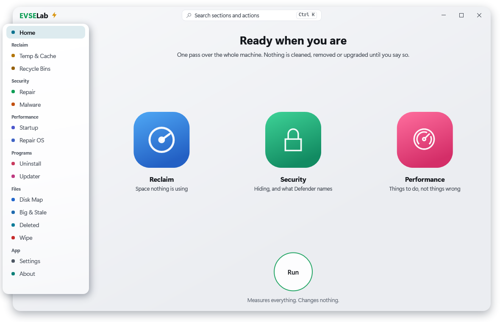
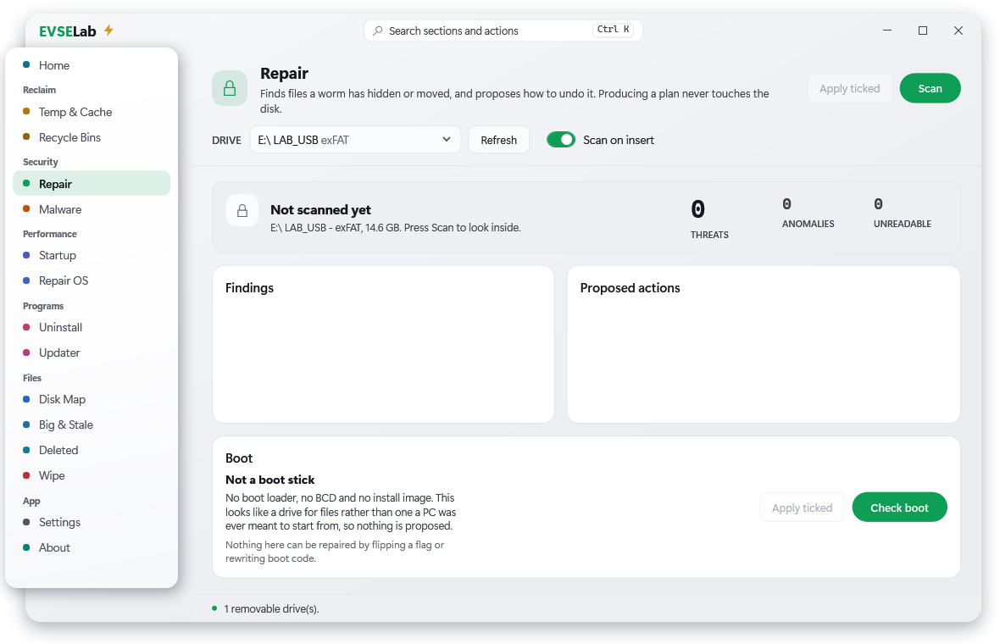
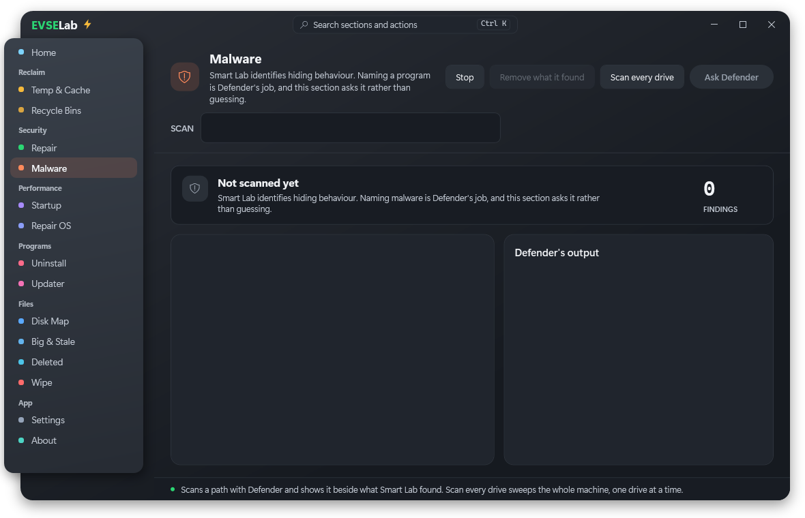
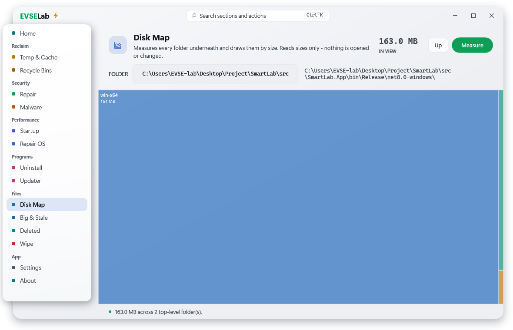
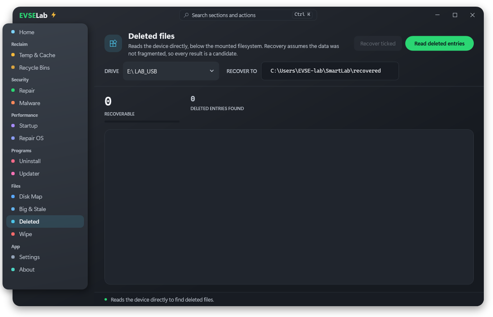
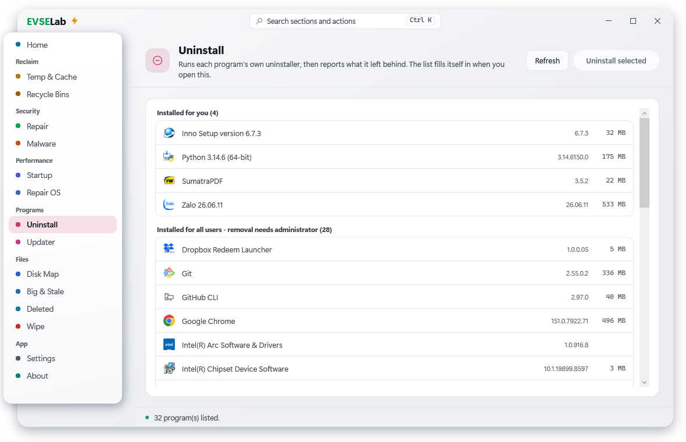
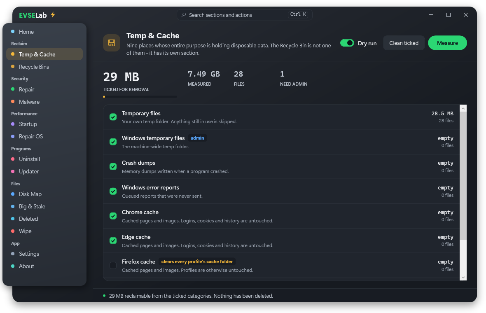
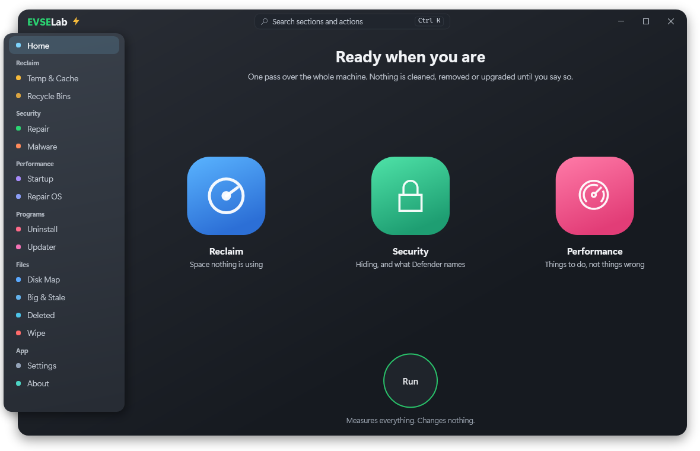

# Smart Lab

A diagnostic and recovery tool for damaged or compromised USB volumes on Windows,
with the machine-maintenance sections that grew out of needing them on the same
machines.

Author: **nc.thanhngo@gmail.com** — EVSE Lab.



Scanning never touches the disk. Smart Lab reports what it found and proposes a plan;
nothing runs until you review it and tick what should happen.

Built from a real incident (2026-07-30, EVSE lab): a 14 GB FAT32 stick appeared empty
but held 14.9 GB of engineering data. A worm had moved everything into a directory
named with a single **U+00A0 NON-BREAKING SPACE**, and dressed a `RECYCLER.BIN` folder
up as the Recycle Bin to carry its payload. `attrib`, `dir`, `robocopy` and `Move-Item`
each fail on that in their own way — [why they fail](docs/design-notes.md) is the
foundation of this codebase.

## Install

Download `SmartLabSetup-<version>.exe` from
[Releases](https://github.com/ncthanhngo/SmartLab/releases) and run it.

The install is **per user**, into `%LOCALAPPDATA%\Programs\Smart Lab`, and asks for no
elevation — the app elevates per operation instead, so the parts that never needed
Administrator never prompt for it. Running the installer over an existing copy upgrades
it in place; close the app first, including its tray icon.

Every release publishes `SHA256SUMS.txt` beside the files. Nothing is code-signed, and
that is a stated position rather than an omission: this project has no certificate, and
a self-signed one buys nothing. The checksum list is what you can actually verify.

```powershell
Get-FileHash .\SmartLabSetup-1.0.2.exe -Algorithm SHA256
```

Already installed? **About → Check for updates** asks GitHub whether a newer release
exists and offers to install it only once it has one it can verify against the
published checksums. Nothing checks on startup, and nothing downloads until you press
the second button.

## What it finds

- **Pathological names** — invisible characters, leading and trailing whitespace Win32
  silently strips, control characters, and bidirectional overrides that disguise file
  extensions.
- **Hiding malware** — user data carrying Hidden+System, fake Recycle Bin folders,
  CLSID disguises, known payload hashes, decoy shortcuts, launching `autorun.inf`.
- **Damage** — entries the scanner can see but not read, and sizes impossible for the
  volume that contains them.
- **Deleted files** — carved back off FAT32 and exFAT, each graded by how much of it is
  likely still intact.

Naming malware is Microsoft Defender's job, asked through `MpCmdRun.exe`. Smart Lab
identifies *hiding behaviour* and does not pretend to be an antivirus.

## The sections

| Group | Sections |
| --- | --- |
| — | Smart Scan |
| Reclaim | Temp & Cache, Recycle Bins |
| Security | Repair, Malware |
| Performance | Startup, Repair OS |
| Programs | Uninstall, Updater |
| Files | Disk Map, Big & Stale, Deleted, Wipe |
| App | Settings, About |

| Repair | Malware |
| --- | --- |
|  |  |

| Disk Map | Deleted |
| --- | --- |
|  |  |

| Uninstall | Temp & Cache |
| --- | --- |
|  |  |

Two themes, chosen rather than inverted:

| Light | Dark |
| --- | --- |
|  |  |

Every screenshot here was rendered by the application itself.
`SmartLab.App.exe --screenshot <dir>` walks the visual tree and writes one PNG per
section — which is also how the interface gets checked on a machine reached over a
locked remote session, where a screen grab would capture the lock screen.

## Command line

```powershell
smartlab scan E:                          # read-only; exit 3 when it finds something
smartlab apply E: --execute               # dry run without --execute
smartlab raw E: --deleted-only --recover D:\rescued
smartlab clean                            # what is disposable, reported not removed
smartlab uninstall                        # remove Smart Lab itself
```

## Build

Requires the .NET SDK 8.0 or later.

```powershell
dotnet build
dotnet test
dotnet run --project src/SmartLab.Cli -- scan E:
```

## Documentation

- [Why this exists, and how it is built](docs/design-notes.md) — the hiding technique,
  the architecture, and the rules the code is held to.
- [What each section does, and why](docs/sections.md) — every section, the decisions
  behind it, and what it deliberately refuses to do.
- [Building, capturing, and releasing](docs/building.md) — the release package, the
  installer, signing, and how the screenshots are made.
- [Status, field notes, and what is left](docs/status.md) — what is implemented, what
  real hardware caught, and the roadmap.
